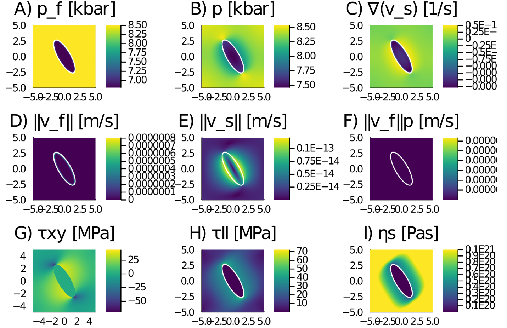

# PseudoTransientHMC

[](https://travis-ci.com/luraess/PseudoTransientHMC.jl)

## Pseudo transient Hydro-Mechanical-Chemical routines
This repository contains Pseudo-Transient (PT) Hydro-Mechanical-Chemical (HMC) routines for simlation of brucite-periclase reactions. The core of the Pseudo-Transient approach relies in using physics-motivated transient terms within differential equations in order to iteratively converge to an accurate solution. The routines rely on the high-performance [ParallelStencil.jl](#https://github.com/samo-lin/ParallelStencil.jl) package for GPU and multi-threaded CPU execution.


## Content
* [Script list](#script-list)
* [Usage](#usage)
* [Output](#output)
* [To-Do](#to-do)


## Script list
The [/scripts](/scripts/) folder contains the current Julia routine, the published Matlab version of it and the `.mat` file with the corresponding thermodynamic data to be loaded as look-up tables
- `PT_HMC_v4.jl`
- `HMC_Public.m`
- `LOOK_UP_HMC_Pub.mat`

The [/tmp](/tmp/) folder contains previous, dev and on-work versions of the current scripts.

## Usage
If not stated otherwise, all the routines are written in Julia and can be executed from the REPL. Output is produced using `Plot.jl`.

Example running the `PT_HMC_v4.jl` routine.

1. Launch Julia
```sh
% julia --project
```
2. Activate and instantiate the environment
```julia-repl
               _
   _       _ _(_)_     |  Documentation: https://docs.julialang.org
  (_)     | (_) (_)    |
   _ _   _| |_  __ _   |  Type "?" for help, "]?" for Pkg help.
  | | | | | | |/ _` |  |
  | | |_| | | | (_| |  |  Version 1.5.0 (2020-08-01)
 _/ |\__'_|_|_|\__'_|  |  Official https://julialang.org/ release
|__/                   |

julia> ]

(PseudoTransientHMC) pkg> instantiate

(PseudoTransientHMC) pkg> st
Project PseudoTransientHMC v0.1.0
Status `~/Documents/git/github/PseudoTransientHMC/Project.toml`
  [a98d9a8b] Interpolations v0.12.10
  [23992714] MAT v0.8.1
  [94395366] ParallelStencil v0.3.0 `git@github.com:samo-lin/ParallelStencil.jl.git#master`
  [91a5bcdd] Plots v1.6.7

julia> 
```
3. Run the script
```julia-repl
julia> include("PT_HMC_v4.jl")
WARNING: replacing module Gateway.
WARNING: replacing module Data.
iter = 1000, error = 1.647e-02 
iter = 2000, error = 1.740e-02 
iter = 3000, error = 4.220e-04 
iter = 4000, error = 4.712e-03 
iter = 5000, error = 4.760e-03 
iter = 6000, error = 1.101e-04 
iter = 7000, error = 8.547e-03 
iter = 8000, error = 4.512e-05 
iter = 9000, error = 4.204e-05 
iter = 10000, error = 9.743e-04 
iter = 11000, error = 3.666e-05 
iter = 12000, error = 3.426e-05 
iter = 13000, error = 5.688e-04 
iter = 14000, error = 2.437e-05 
iter = 15000, error = 1.057e-03 
iter = 16000, error = 7.640e-04 
iter = 17000, error = 1.751e-05 
iter tot = 17000
 41.554355 seconds (30.60 M allocations: 1.261 GiB, 0.77% gc time)

julia> 
```

## Output
The output of running the `PT_HMC_v4.jl` script on an Nvidia TitanX GPU with `nx=1023, ny=1023` is following



## To-Do
A non-exhaustive list of potential future next steps:
- add acceleration (damping & friends)
- add a 3D version
- perform some perf tests and resolution tests
- complete the README
  - with references and cross-refs
  - further links to GPU-related computing, Julia-related computing, to stencil-based HPC Julia modules and distributed memory parallelisation Julia modules
- certainly more to come... stay tuned
