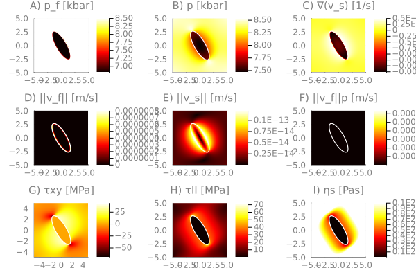

# Pseudo-transient Hydro-Mechanical-Chemical (HMC)
This repository contains Pseudo-Transient (PT) Hydro-Mechanical-Chemical (HMC) routines for simulation of brucite-periclase reactions [(Schmalholz et al., 2020)](https://doi.org/10.1029/2020GC009351). The core of the Pseudo-Transient approach relies in using physics-motivated transient terms within differential equations in order to iteratively converge to an accurate solution. The routines rely on the high-performance [ParallelStencil.jl](https://github.com/omlins/ParallelStencil.jl) package for GPU and multi-threaded CPU execution.

## Content
* [Script list](#script-list)
* [Usage](#usage)
* [Output](#output)
* [To-Do](#to-do)
* [References](#references)

## Script list
The [scripts](scripts/) folder contains the Julia routine, the published Matlab version of it and the `.mat` file with the corresponding thermodynamic data to be loaded as look-up tables. The "analytical" scripts include a paramtetrisation of the solid and fluid densities and composition as function of fluid pressure to circumvent costly interpolation operations:
- [`PT_HMC_v4_analytical.jl`](scripts/PT_HMC_v4_analytical.jl)
- `PT_HMC_v4.jl`
- `HMC_Public_analytical.m`
- `HMC_Public.m`
- `LOOK_UP_HMC_Pub.mat`

The [tmp](tmp/) folder contains previous, dev, and on-work versions of the main scripts.

## Usage
If not stated otherwise, all the routines are written in Julia and can be executed from the [Julia REPL], or from the terminal for improved performance. Output is produced using the [Julia Plots package].

The either multi-threaded CPU or GPU backend can be selected by adding the appropriate flag to the `USE_GPU` constant 
```julia
const USE_GPU  = false
```
- Selecting `false` will use the `Base.threads` backend. Multi-threading can be enabled by defining and exporting the `JULIA_NUM_THREADS` environment variable (e.g. `export JULIA_NUM_THREADS=2` prior to launching Julia will enable the code to run on 2 CPU threads). 
- Selecting `true` will use the [CUDA.jl] GPU backend and will succeed if a CUDA-capable GPU is available.

### Example running the routine from the REPL

1. Launch Julia
```sh
% julia --project
```
2. Activate and instantiate the environment to download all required dependencies:
```julia-repl
julia> ]

(PseudoTransientHMC) pkg> activate .

(PseudoTransientHMC) pkg> instantiate
```
3. Run the script
```julia-repl
julia> include("PT_HMC_v4_analytical.jl")
```

### Example running the routine from the terminal

1. Launch the Julia executable using the project's dependencies `--project`, disabling array bound checking for enhanced performance `--check-bounds=no`, and using optimization level 3 `-O3`.
```sh
% julia --project --check-bounds=no -O3 PT_HMC_v4_analytical.jl
```
Additional startup flag infos can be found [here](https://docs.julialang.org/en/v1/manual/getting-started/#man-getting-started)

## Output
<!-- The output of running the[`PT_HMC_v4.jl`](scripts/PT_HMC_v4.jl) script on an Nvidia TitanXp GPU with `nx=1023, ny=1023`:


 -->

The output of running the [`PT_HMC_v4_analytical.jl`](scripts/PT_HMC_v4_analytical.jl) script


## To-Do
🚧 A non-exhaustive list of future next steps:
- add acceleration (damping & friends)
- add a 3D version
- perform some perf tests and resolution tests
- complete the README
  - with references and cross-refs
  - further links to GPU-related computing, Julia-related computing, to stencil-based HPC Julia modules and distributed memory parallelisation Julia modules
- certainly more to come...

## References
[Schmalholz, S. M., Moulas, E., Plümper, O., Myasnikov, A. V., & Podladchikov, Y. Y. (2020). 2D hydro‐mechanical‐chemical modeling of (De)hydration reactions in deforming heterogeneous rock: The periclase‐brucite model reaction. Geochemistry, Geophysics, Geosystems, 21, 2020GC009351. https://doi.org/10.1029/2020GC009351](https://doi.org/10.1029/2020GC009351)

[CUDA.jl]: https://github.com/JuliaGPU/CUDA.jl
[Julia Plots package]: https://github.com/JuliaPlots/Plots.jl
[Julia REPL]: https://docs.julialang.org/en/v1/stdlib/REPL/
