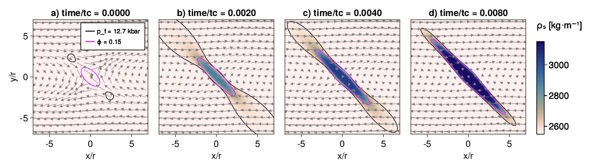

# Pseudo-transient Hydro-Mechanical-Chemical

[](https://github.com/PTsolvers/PseudoTransientHMC.jl/actions/workflows/CI.yml?query=branch%3Amain)
[](https://zenodo.org/badge/latestdoi/299357364)


This repository contains Pseudo-Transient (PT) routines resolving chemical reactions coupled to fluid flow in viscously defroming solid pourous matrix, so-called Hydro-Mechanical-Chemical (HMC) coupling. Example of such multi-physical processes to understand, e.g, the formation of olivine veins by dehydration of ductile serpentinite ([Schmalholz et al., 2023](https://doi.org/10.1029/2023JB026985)), or the brucite-periclase reactions ([Schmalholz et al., 2020](https://doi.org/10.1029/2020GC009351)).


> Serpentinite dehydration and olivine vein formation during ductile shearing

Pseudo-Transient approach relies in using physics-motivated transient terms within differential equations in order to iteratively converge to an accurate solution. The PT HMC routines are written using the [Julia programming language](https://julialang.org) and build upon the high-performance [ParallelStencil.jl](https://github.com/omlins/ParallelStencil.jl) package to enable for optimal execution on graphics processing units (GPUs) and multi-threaded CPUs.

## Script list
The Julia scripts are located in the [scripts](scripts) folder which contains the routines for the [(Schmalholz et al., 2023)](https://doi.org/10.1029/2023JB026985) study.
- The main script is [`DeHy.jl`](scripts/DeHy.jl);
- The visualisation script is [`vizme_DeHy.jl`](scripts/vizme_DeHy.jl).

## Usage
All the routines are written in Julia and can be executed from the [Julia REPL], or from the terminal for improved performance. Output is produced using [Makie.jl] (using the `CairoMakie` backend).

The either multi-threaded CPU or GPU backend can be selected by adding the appropriate flag to the `USE_GPU` constant, modifying either the default behaviour in the top-most lines of the codes
```julia
const USE_GPU  = haskey(ENV, "USE_GPU" ) ? parse(Bool, ENV["USE_GPU"] ) : false
```
or by setting/exporting the desired environment variable.

- Selecting `false` will use the `Base.threads` backend. Multi-threading can be enabled by defining and exporting the `JULIA_NUM_THREADS` environment variable (e.g. `export JULIA_NUM_THREADS=2` prior to launching Julia will enable the code to run on 2 CPU threads).
- Selecting `true` will use the [CUDA.jl] GPU backend and will succeed if a CUDA-capable GPU is available.

### Example running the routine from the REPL

1. Launch Julia
```sh
% julia --project
```
2. Activate and instantiate the environment to download all required dependencies:
```julia-repl
julia> ]

(PseudoTransientHMC) pkg> activate .

(PseudoTransientHMC) pkg> instantiate
```
3. Run the script
```julia-repl
julia> include("DeHy.jl")
```

### Example running the routine from the terminal

Launch the Julia executable using the project's dependencies `--project`:
```sh
julia --project DeHy.jl
```

## References
Schmalholz, S. M., Moulas, E., Plümper, O., Myasnikov, A. V., & Podladchikov, Y. Y. (2020). **2D hydro‐mechanical‐chemical modeling of (De)hydration reactions in deforming heterogeneous rock: The periclase‐brucite model reaction**. Geochemistry, Geophysics, Geosystems, 21, 2020GC009351. [https://doi.org/10.1029/2020GC009351](https://doi.org/10.1029/2020GC009351)

Schmalholz, S. M., Moulas, E., Räss, L., & Müntener, O. (2023). **Shear-driven formation of olivine veins by dehydration of ductile serpentinite: a numerical study with implications for porosity production and transient weakening.** [https://doi.org/10.1029/2023JB026985](https://doi.org/10.1029/2023JB026985)

[CUDA.jl]: https://github.com/JuliaGPU/CUDA.jl
[Makie.jl]: https://docs.makie.org/stable/
[Julia REPL]: https://docs.julialang.org/en/v1/stdlib/REPL/
